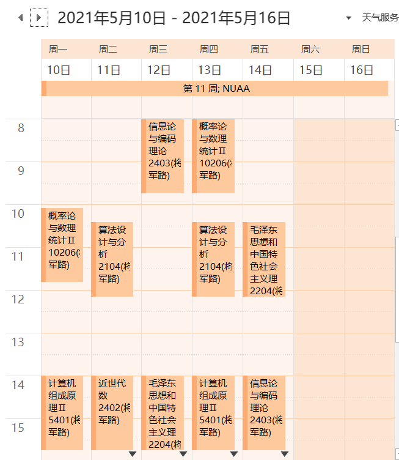
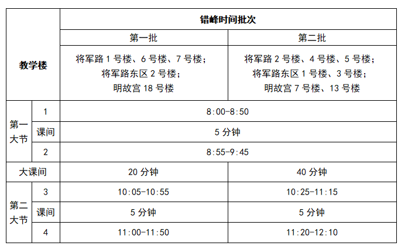
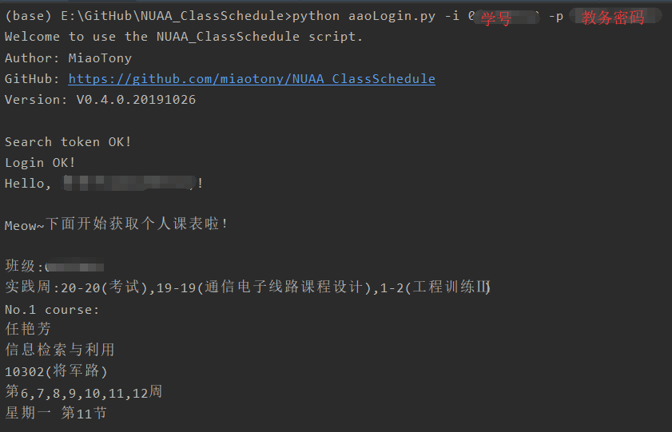
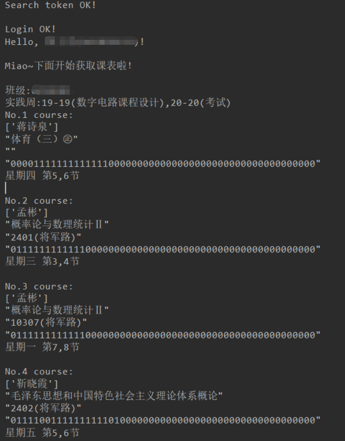

## Change log

### `V0.25.1.20230807`

[fix] requirement: Using `demjson3` instead of `demjson` to support Python3 only.   
依赖中的 `demjson` 修改为 `demjson3`，只考虑支持 Python3.   
*（`demjson` 打包的时候与 `setuptools` 版本冲突，会报错 `error in demjson setup command: use_2to3 is invalid.`，Python 2 与 3 的兼容性问题老大难了）*     
[chore] Update the version of some requirements.   
更新了部分依赖的版本。

### `V0.25.0.20230807`

[fix] Fix Issue#30 login error due to adjusting login method and requiring the use of mobile verification code as 2FA.   
Issue#30，修复了教务系统登录方式调整，新增了手机验证码作为 2FA 而导致无法成功登录的 bug。在本版本中根据提示输入手机验证码即可。   
[chore] Update the version of requirements.   
更新了依赖的版本，修复一些供应链带来的漏洞。  

### `V0.24.0.20220220`

[fix] Change HTTP to HTTPS to fix the error due to WAF in HTTP.   
修复 HTTP 访问存在防火墙而导致的错误，更改为通过 HTTPS 进行请求，同时也更安全。  

### `V0.23.0.20210509`

[feat] Add events for week number.   
新增周数事件，即持续一周的 `第x周` 事件，方便知道当前所在周。默认一个学期为20周。   
默认不开启此功能，在命令行执行时加入 `--weeknum` 即可开启。   

### `V0.22.0.20210423`

**本版本修改了关键的课表查询接口！**  

[fix] Fix `can not find the course table url` bug.   
从2021年4月8日下午开始，教务系统又改回个人课表的界面了。于是把 `getCourseTable` 函数接口又改回去了。   
[fix] Update requirement version.    
升级了依赖的版本。  

### `V0.21.0.20201221`

**请注意，本版本修改了关键的课表查询接口！**  

[fix] Fix Issues #19 the bug when parsing timetable.  
修复教务系统课表查询界面修改导致的课表无法解析的问题。  
[fix] Fix exam output format.  
考试列表里多了一列考场校区，修复了一下输出的格式。  
[fix] Update requirement version.    
升级了依赖的版本，但还是建议在虚拟环境中运行。  

**[Known Issue]**  
Only personal timetable is supported, class timetable cannot be queried temporarily.  
只支持个人课表，班级课表暂时无法查询。  

### `V0.20.0.20201116`

[feat] Fit the different course time batches for Tianmuhu Campus.   
匹配天目湖校区分批上下课时间。  
[fix] ICS: Fix the end time of lessons across the midday.   
修正跨中午等超长课程结束时间错误的bug。

### `V0.19.1.20201007`
  
[feat] Add packing automatically based on GitHub Action.   
新增基于 GitHub Action 自动打包可执行程序。  
当 push tag 时自动调用 workflow 打包 Windows、MacOS、Ubuntu 环境下的可执行程序，
并发布到 [Release 页面](https://github.com/miaotony/NUAA_ClassSchedule/releases/)。  

### `V0.19.0.20200923`
  
[feat] Add new web frontend, refer to [NUAA AnyKnew](https://anyknew.a2os.club/Schedule?from=github).  
新增新版网页前端，支持在线查课表、导出 iCalendar 日历文件，详情请访问 [NUAA AnyKnew](https://anyknew.a2os.club/Schedule?from=github)，欢迎来试试呀！     
[fix] ICS: Update course order for even units.   
修正偶数节课开始时的课表导出bug。  

### `V0.18.0.20200831`
  
[feat] Fit the different course time batches.  
疫情期间错峰上下课时间批次修正。  

**由于教室匹配时存在局限性，请注意仔细核对课程信息，尤其是三四小节课的上课时间，由此导致的问题概不负责！**   

详见 [关于疫情期间错峰下课的通知](http://aao.nuaa.edu.cn/2020/0828/c11066a213716/page.htm)。  
  

### `V0.17.0.20200818`

**!!!ATTENTION!!! The interface of this version has been changed greatly!**    
**请注意，本版本函数接口有较大改动！**    
[feat] Get the start date of a specific semester.   
从教务系统获取指定学期的开学日期，不需要再手动修改啦！  
[feat] Get the current semester.   
从教务系统`homeExt.action`页面获取当前学期的信息，并与控制台输入兼容。  
[feat] Add the semester option.   
控制台、命令行参数中加入了学期的选项，支持导出指定学期的信息，默认则选择当前学期。  
[refactor] Rename the files for export, optimize the code, etc.   
修改了导出文件的文件名，优化代码结构，等等。  

**[Known Issue]**  
GUI has not been updated yet!   
很抱歉，GUI 图形化界面的程序暂时并未更新，后期视情况可能会重写。  

### `V0.16.0.20200714`

[feat] Add Telegram bot.  @NUAA_iCal_bot   
新增 Telegram 端在线导出 iCalendar 文件的机器人，欢迎使用哈！  https://t.me/NUAA_iCal_bot  
[refactor] Update `getClassSchedule.py`, delete `retry_cnt` param for `aao_login`.  
删除了登录教务系统函数接口中的重试次数参数，进一步细化了如“验证码错误”等登录过程。  

### `V0.15.2.20200520`

Replace `exit` with `raise Exception`.  
用抛出异常来取代直接退出。  
去除一些多余的代码。  
重新打包生成新的可执行文件，新增 GUI 界面的可执行程序。  

### `V0.15.1.20200520`

Fix a requirement bug.  
指定了`requirements.txt`中的依赖版本，修复依赖的版本问题。  
估计是 beautifulsoup4 版本升级中修改了一些接口。  

### `V0.15.0.20200520`

Fix a captcha display bug. （Issue #13）  
修复了验证码显示的问题，在不同平台下调用系统的应用来打开验证码图片。  
Update document. 更新了说明文档，分离了 Change log。

### `V0.14.0.20200213`

Update semester_start_date to 20200224 for 2019-2020(2) semester. Delete curriculum choice (person or class).   
默认导出个人课表，只在命令行中保留导出班级课表的选项。  

### `V0.13.0.20191207` 

Fix Issue #14 【获取课表到获取考试信息后直接报错 `list index out of range`】

### `V0.12.0.20191124` 

新增导出考试安排；新增基于tkinter实现GUI界面，并与CLI相互兼容，但仍存在小bug。  
（For Hackathon 2019 @ East China, 20191123-24, with Cooook & Pinyi Qian)    

### `V0.11.0.20191121` 

Fix Issue #13 captcha bug, but only for Windows.  
调用PIL库显示验证码，仅Windows下有效。    

### `V0.10.0.20191116` 

新增命令行导出选项参数；  
重新打包，精简可执行程序大小并新增MacOS版本；  
修复Linux下`sh: 1: pause: not found` bug  

### `V0.9.0.20191115` 

新增打包为`.exe`可执行程序，可在未安装python环境的Windows系统下使用  

### `V0.8.1.20191113` 

修复表格导出bug，完善`requirement.txt`等  

### `V0.8.0.20191112` 

新增导出课表到`.xlsx`表格文件；调换输出课程名称和教师顺序，更加符合逻辑   

### `V0.7.0.20191109` 

新增导出课表到`.txt`文件；  
新增匹配天目湖校区时间表；  
修复Issue #2 `Too Quick Click` bug；  
删除`requirement.txt`中存在的标准库，仅保留第三方库。  

### `V0.6.0.20191108` 

基于对象重构课表解析的部分功能，增加生成iCal日历文件并导出（部分参考NUAA-iCal-Python）  

### `V0.5.1.20191107`

优化代码结构，便于下一步重构及生成iCal文件  

### `V0.5.0.20191107` 

修复因教务系统JS代码变更而无法解析课表的重大bug，增加`requirement.txt`

### `V0.4.0.20191026` 

增加命令行参数解析，增加控制台输入学号密码（不回显处理），并与初始设置兼容；  
修复班级课表中教师为空时解析异常bug  
  

### `V0.3.1.20191018` 

增加解析课程所在周并优化课表输出格式，  
修复班级课表中班级解析bug，  
引入logging模块记录日志便于debug  

### `V0.3.0.20191017` 

增加 课表解析，增加 班级、实践周匹配，优化代码结构   
  

### `V0.2.1.20191012` 

增加UA列表，增加BeautifulSoup提取姓名学号，优化代码结构，为下一步解析课表做准备  

### `V0.2.0.20191010` 

成功登录教务系统，并成功获取个人或班级课表，但还未进行提取  

### `V0.1.1.20190910` 

加入未登录成功或过快点击的判断  

### `V0.1.0.20190909` 

尝试登录新教务系统成功，仅登录而已  

