# 如何将 `.ics` 日历文件导入日历？

**How to import?**

**Author:** @Xm798 

## 导入设备

**注意：** 导入任何日历之前，都建议新建一个新的日历用于导入操作，便于出错时批量修改，以及不同颜色更容易区分。

### iOS设备

直接将生成的文件传输到手机后点击打开，选择“导入日历”即可。

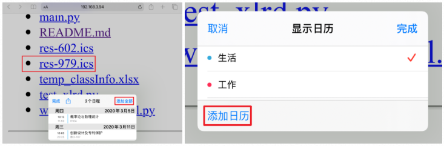

### Android 与 Windows 设备

部分Android设备的原生日历并不支持 `.ics` 文件的导入功能，其实更加推荐的方法是**借助于Google Calendar 或者 Outlook 来完成日程管理**，因为无论是谷歌日历还是微软的Outlook，都可以很方便的完成手机、PAD 与 Windows 设备之间的日历同步。

如果有科学手段，可以选用 Google Calendar，如果没有，Outlook 也是一个极为不错的选择，全凭个人喜好。

#### Google Calendar导入

电脑端打开 [Google Calendar](https://calendar.google.com/)，选择添加其他日历-导入，记得选择一个单独的日历，如果没有，可以新建一个。点击导入，即可完成。

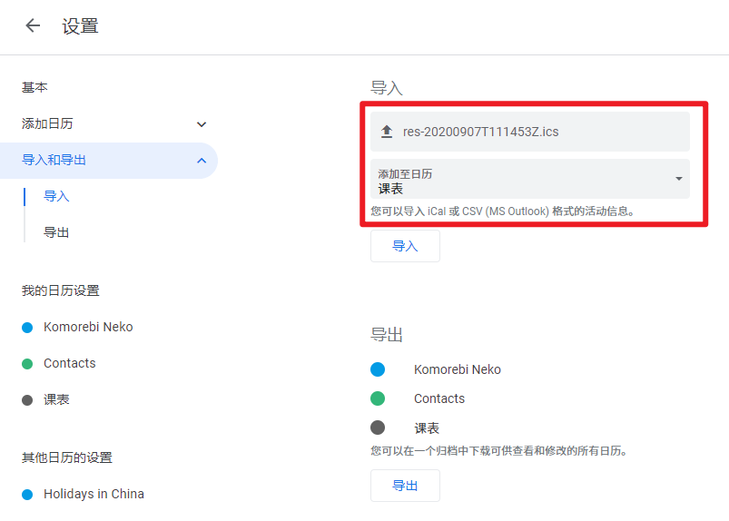

也可以在手机端完成导入，在安装好谷歌日历的情况下，直接点击接收到的 `.ics` 文件，选择使用“日历”打开，即可。

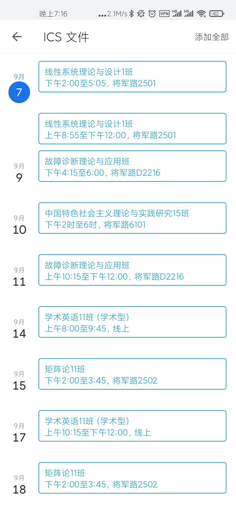

#### Outlook导入

电脑端访问 [Outlook](https://office.live.com/start/Outlook.aspx)，使用微软账号登录。

点击左侧的“日历”，添加日历-创建空白日历，新建一个课表日历。

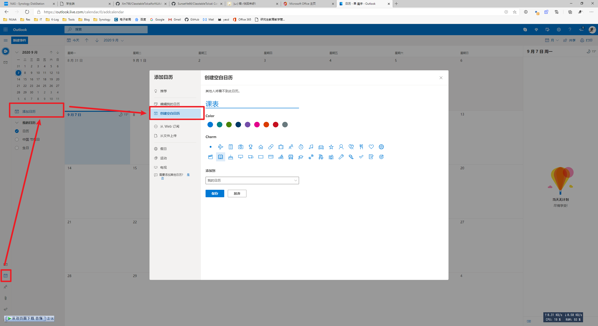

然后选择“从文件上传”，选择生成的 `.ics` 文件，导入到创建的课表日历中即可。

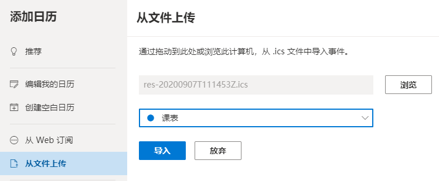

或者，Windows10系统可以直接在本地右键 `.ics` 文件，选择使用系统日历打开。

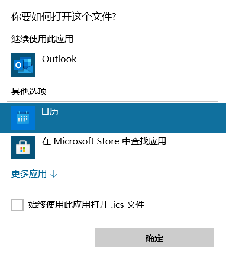

然后导入到日历即可。首次使用可能需要登录账号，此处登录微软账号或 Gmail 或其他任何支持的账号都可以。

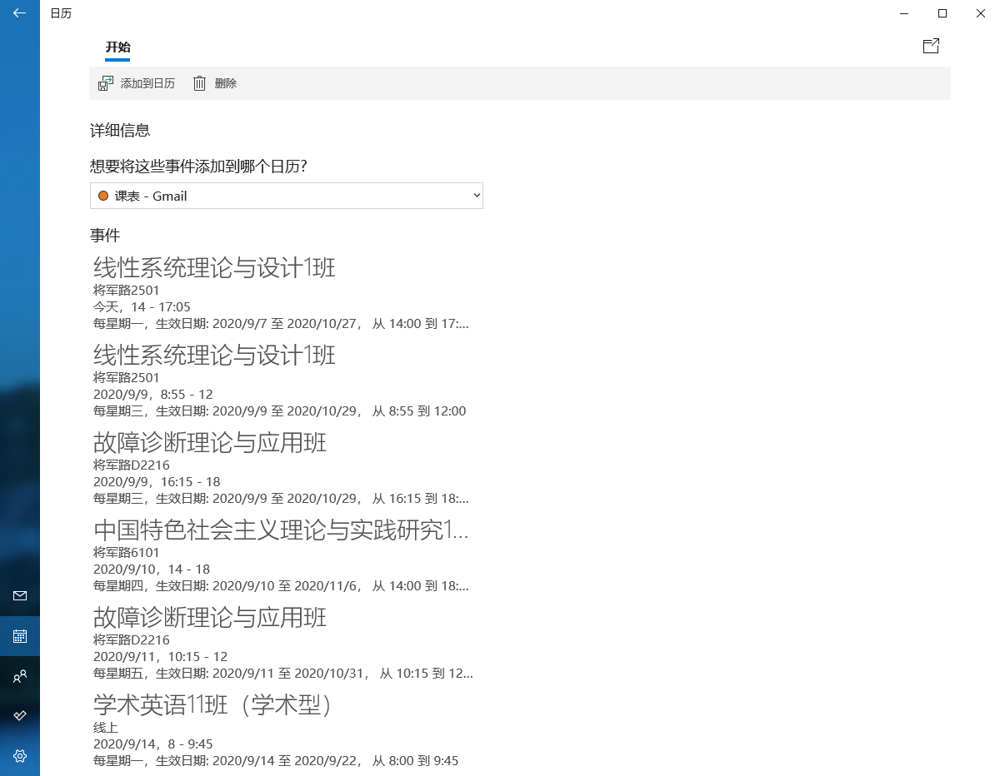

---

## 跨平台同步

在手机端、电脑端、PAD 端登录同一账号之后，即可实现全平台同步。

### Android端

若使用 Google Calendar，手机端需要安装谷歌日历应用；若使用 Outlook，手机端需要安装Outlook应用。当然，部分安卓操作系统的系统日历可以直接订阅谷歌日历和 Outlook 的日历，不安装 App 使用系统日历也完全OK。

例如，小米日历在“日历-设置-日历账号管理”中，可以添加 Gmail 日历。

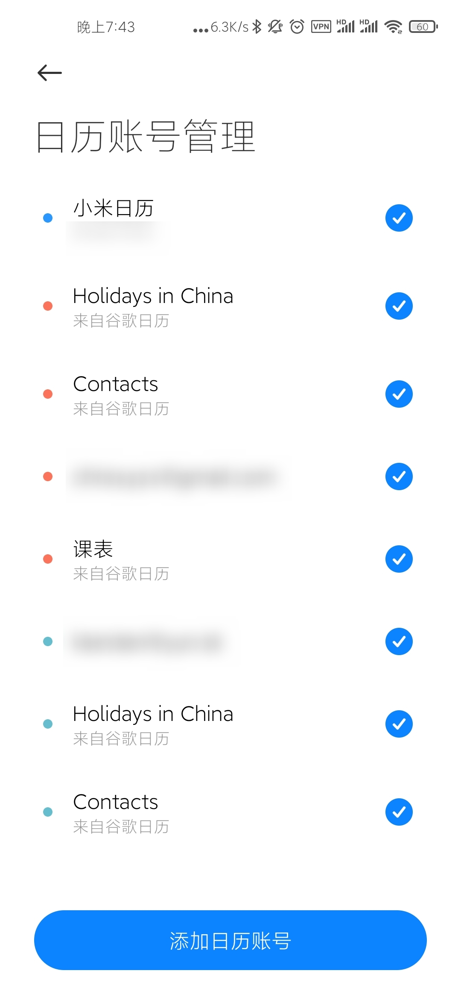

### 电脑端

Windows10 系统使用系统的“邮件与日历”应用，登录对应账号，即可完成电脑端平台的日历同步。

如果是使用Google服务，需要先解除UWP应用的代理限制，请自行搜索“解除UWP应用网络隔离”，或参阅[Win10解除UWP应用网络隔离允许访问代理](https://blog.rneko.com/archives/12/)。推荐使用**Fiddler**中的 **WinConfig** 模块，全部解除隔离。

---

## 效果展示

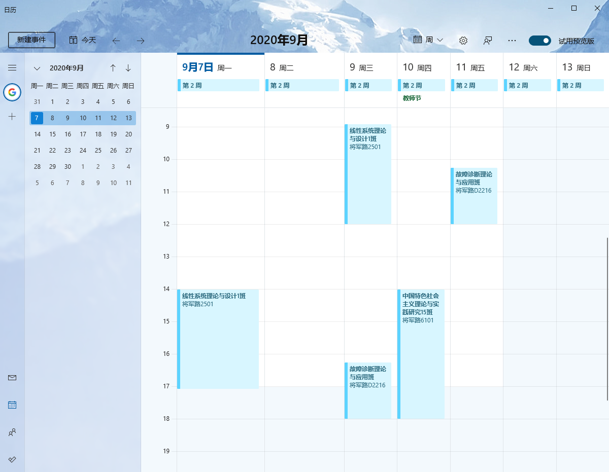

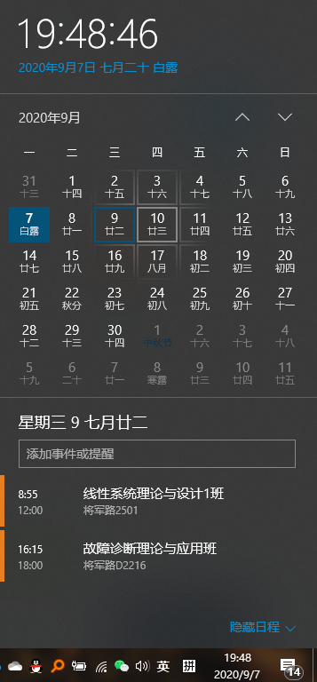

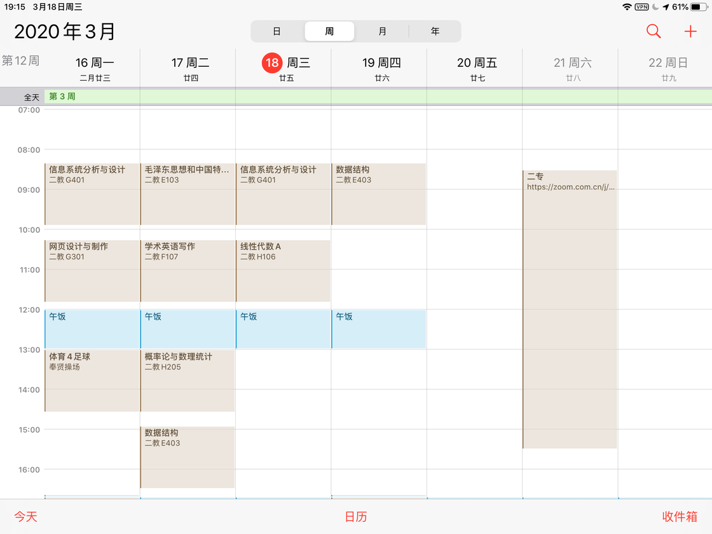

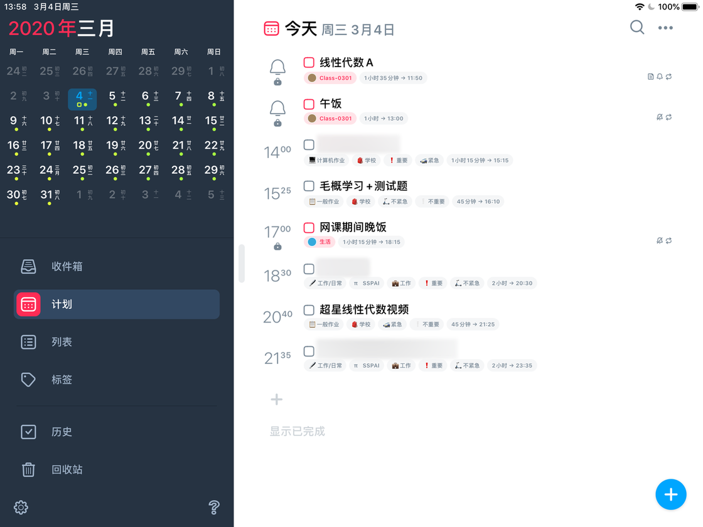

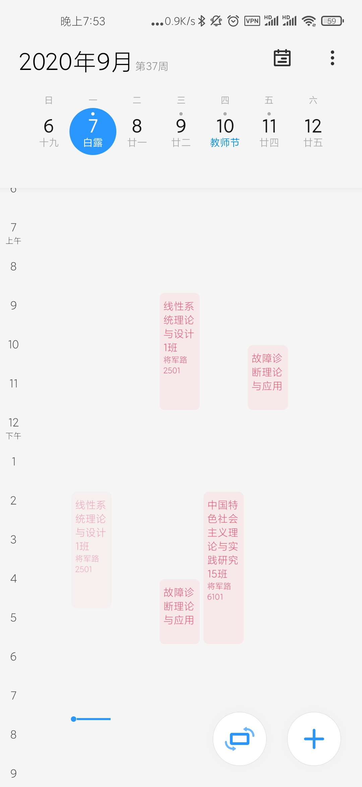

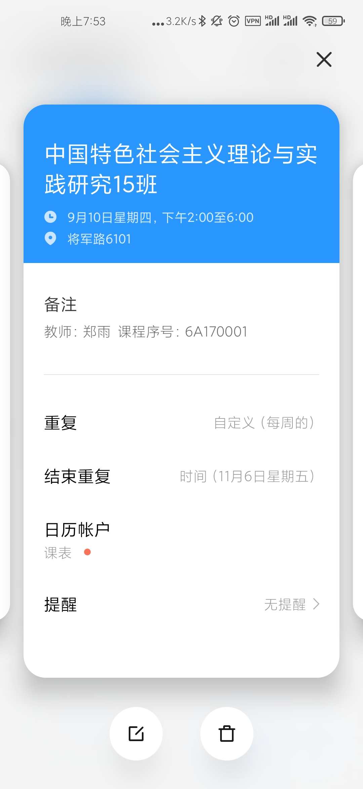

