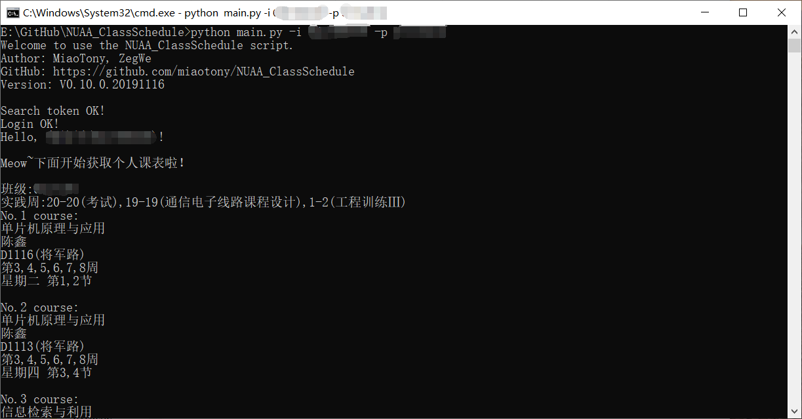
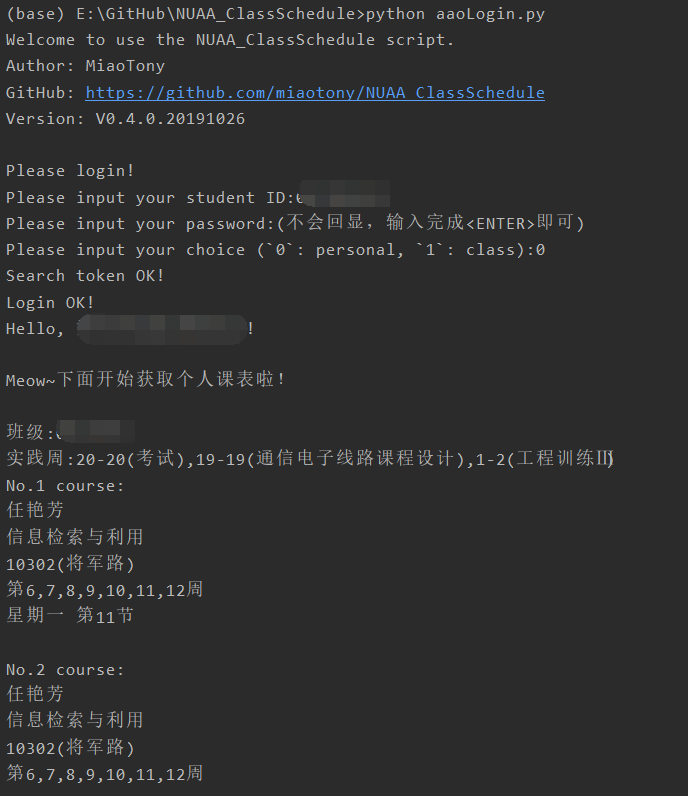
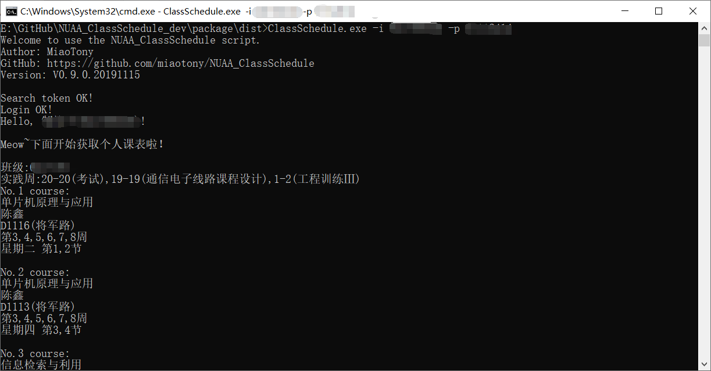
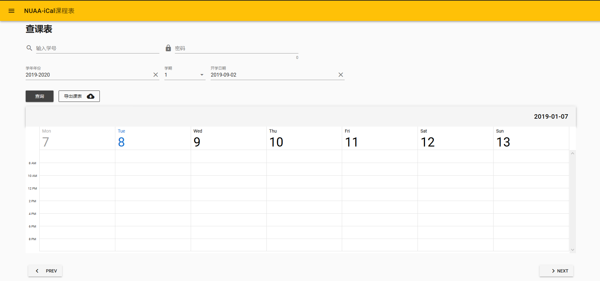
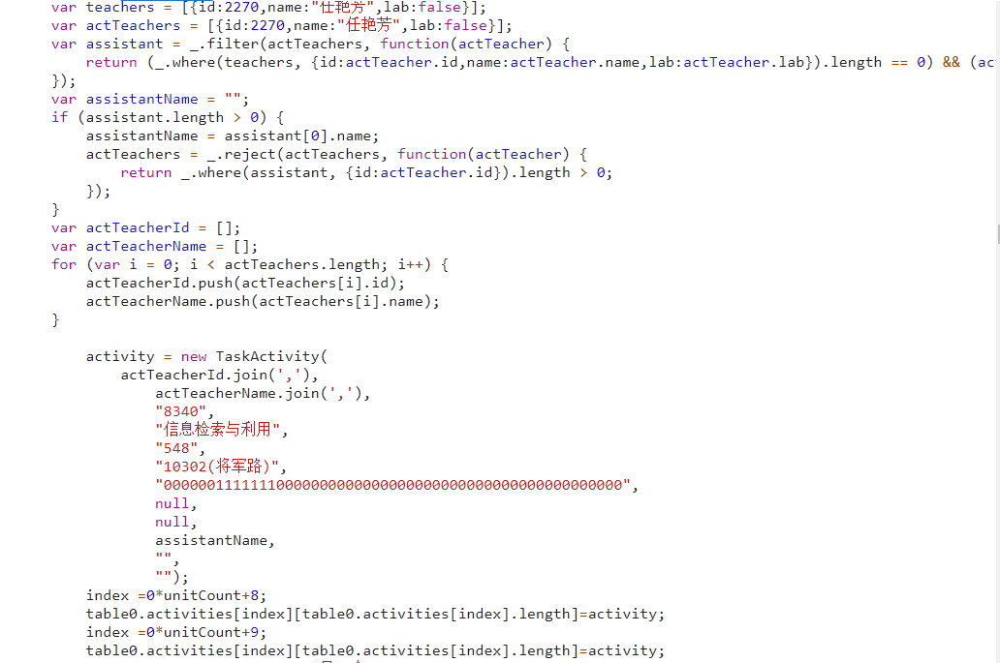

# NUAA_ClassSchedule

欢迎尝试[**本项目在线版本**](https://nuaaical.herokuapp.com/)    

[*点此访问本项目网页*](https://miaotony.github.io/NUAA_ClassSchedule/)  

[*点此访问本项目GitHub仓库*](https://github.com/miaotony/NUAA_ClassSchedule)  


## Description

NUAA_ClassSchedule  
登录南京航空航天大学新教务系统，获取课表及考试信息，解析后生成 iCal 日历及 xlsx 表格文件，进而导入 Outlook 等日历。     

>- 话说大家平常是怎么看课表的呀？  
>- **上教务系统** / **截图** / **小程序** / **手动建课表** / **问同学** / ...   
>
>- I have an idea! 大家有没有想过把课表导入到日历呀？！  
>你看，这么做不仅可以**自定义课程**，和其他安排放在一起；  
>还可以利用**桌面插件**，方便快捷地获取课表；  
>还能根据自己的需要**设定提醒**……  
>更多用途可以自由发挥，多棒的主意呢！  
> 
>
>说实话，这的确就是偶然间想到的一个小想法呢，说干就干，于是就有了这个项目啦！  
>还在犹豫什么呢，不如就来试试吧！嘿嘿嘿~  


其实这个项目挺有意思的233 *(斜眼笑.gif)*  

所以——    
感兴趣的一起来干呗！   
**欢迎提issue & PR！**  


### **Important!! 免责条款**  

本项目课表由官方教务系统导出，但使用时**请仔细对照教务系统核对是否所有课程均正常导出**！  

**对于解析异常导致的各种后果请自行承担！**   
*（坚决不背锅）*  

 技术问题请提issue，非技术问题原则上不予处理，请咨询有关部门，谢谢！  

>点击访问[**南航新版教务系统**](http://aao-eas.nuaa.edu.cn/eams/login.action)


---
## Usage
**食用指南**  

**请在`Python 3`环境下食用**。   


>- 什么？你没有 Python 环境？ 或者 你不想折腾？  
>- 在 Windows 或 MacOS 下可以试试这个打包好的可执行程序啦！    
>（MacOS版本由 @ZegWe 提供）  

下载地址在 [Release](https://github.com/miaotony/NUAA_ClassSchedule/releases) 下呢！  
欢迎来试试呀！  

>如果喜欢折腾，或者不放心的话，推荐还是用下面的方法呢！  


### **Step**  

#### Step 1   
 进入你喜欢的目录，将本仓库clone到本地，或直接下载`zip`文件（Download ZIP）   
```
git clone https://github.com/miaotony/NUAA_ClassSchedule.git
```

#### Step 2  
 进入目录，安装所需的库（Linux下使用pip3，Windows下使用pip）  
```
pip3 install -r requirements.txt
```

#### Step 3  

这一步有3种方案，任意一种都有效呢！

**方案1：控制台输入**  

首先执行程序。  
Windows 环境下：  
```
python main.py
```

Linux 环境下：  
```
python3 main.py
```
或者 直接执行main.py （前提是将文件权限设为**可执行**）  
```
chmod +x *
./main.py
```

而后在控制台输入学号、密码及验证码。  

为了保护，密码不带回显，输完之后`<ENTER>`就好啦！  

验证码图片会调用系统默认的应用来打开。

**方案2：命令行参数**  

> 从 `V0.4.0.20191026` 版本起开始支持命令行参数啦！  

> 从 `V0.14.0.20200213` 版本开始，控制台默认导出个人课表，只在命令行中保留导出班级课表的选项。


**命令行参数说明：**  
```
usage: main.py [-h] [-i ID] [-p PWD] [-c {0,1}] [--noexam] [--notxt]
               [--noxlsx]

Get NUAA class schedule at ease! 一个小jio本，让你获取课表更加便捷而实在~

optional arguments:
  -h, --help            show this help message and exit
  -i ID, --id ID        Student ID 学号
  -p PWD, --pwd PWD     Student password 教务处密码
  -c {0,1}, --choice {0,1}
                        Input `0` for personal curriculum(default), `1` for
                        class curriculum. 输入`0`获取个人课表(无此参数默认为个人课表)，输入`1`获取班级课表
  --noexam              Don't export exam schedule. 加入此选项则不导出考试安排
  --notxt               Don't export `.txt` file. 加入此选项则不导出`.txt`文件
  --noxlsx              Don't export `.xlsx` file. 加入此选项则不导出`.xlsx`表格
```

示例：  
```
python main.py -i <your ID> -p <your password> 
```

运行程序后会弹出验证码图片，在控制台输入验证码即可。  

**方案3：修改程序参数（不推荐）**   

使用时先修改`main.py`程序里的`stuID`为学号，`stuPwd`为教务处密码。  
请在`r""`两个引号之间输入，即变量类型为字符串str。  
  
`choice`为个人或班级课表的选择，0为个人，1为班级，**默认为个人课表**。  
而后保存，再执行此程序即可。  
  
**密码仅在本地保存，访问官方教务系统，请放心使用。**   
  

当然，上述三种方案之间在默认情况下是互相兼容的，解析的优先级由高到低为：  
命令行参数->上面的初始设置->控制台输入  


#### Step 4  
按上面的方法运行后即可得到解析好的课表啦~   
在`NUAAiCal-Data`目录下就可以看到生成好的`.ics`日历文件，`.txt`文本文件，还有`.xlsx`表格文件啦！  
  
> 从 `V0.10.0.20191116` 版本开始，导出选项可通过命令行参数进行选择。  


#### Step 5  
将生成好的`.ics`日历文件导入你喜欢的日历，然后尽情享用吧~！  
**顺手再点个Star吧~**   
**在导入iCal日历前，请确认时区已设定为 `UTC/GMT+08:00` 即北京时间，否则可能会出现导入后时间不正确的情况！**   

    
### **Screenshots 使用截图**    

**使用命令行参数：**  
  

**控制台输入：**  
  

**使用`.exe`程序执行：** （V0.9.0.20191115 开始支持）   
  
Or 从命令行执行：  
  

**GUI界面：**（`V0.12.0.20191124`）    


**导出`.ics`文件：**   
  

**将`.ics`导入到Outlook的效果：**   
  

Outlook客户端：  
  

**将课表导出到`.xlsx`文件：**  


**导出到文本文件：**   


**WEB端部署：**（仍在测试中）     



web端版本目前已经部署在了 heroku 上，网址：[点此访问本项目在线版本](https://nuaaical.herokuapp.com/)  
或 https://nuaaical.herokuapp.com/  

欢迎来尝试一下哈~  

>在线版本的源码请参考`NUAA_iCal_Web`仓库。  
https://github.com/miaotony/NUAA_iCal_Web


### Raw Data  
课表解析部分原始 JavaScript 数据片段：   

> 20191107 更新：  
教务系统中`TaskActivity`函数新增了一个`teachClassName`参数，导致之前的版本匹配出现问题，
在 `V0.5.0.20191107` 版本中已经修复。  

```javascript
var teachers = [{id:2270,name:"任艳芳",lab:false}];
var actTeachers = [{id:2270,name:"任艳芳",lab:false}];
var assistant = _.filter(actTeachers, function(actTeacher) {
    return (_.where(teachers, {id:actTeacher.id,name:actTeacher.name,lab:actTeacher.lab}).length == 0) && (actTeacher.lab == true);
});
var assistantName = "";
if (assistant.length > 0) {
    assistantName = assistant[0].name;
    actTeachers = _.reject(actTeachers, function(actTeacher) {
        return _.where(assistant, {id:actTeacher.id}).length > 0;
    });
}
var actTeacherId = [];
var actTeacherName = [];
for (var i = 0; i < actTeachers.length; i++) {
    actTeacherId.push(actTeachers[i].id);
    actTeacherName.push(actTeachers[i].name);
}

    activity = new TaskActivity(
        actTeacherId.join(','),
            actTeacherName.join(','),
            "8340",
            "信息检索与利用",
            "548",
            "10302(将军路)",
            "00000011111110000000000000000000000000000000000000000",
            "",
            null,
            assistantName,
            "",
            "",
            "");
    index =0*unitCount+8;
    table0.activities[index][table0.activities[index].length]=activity;
    index =0*unitCount+9;
    table0.activities[index][table0.activities[index].length]=activity;
    
```

其中的`TaskActivity`函数如下：  
```javascript
// new taskAcitvity
function TaskActivity(teacherId,teacherName,courseId,courseName,roomId,roomName,vaildWeeks,taskId,remark,assistantName,experiItemName,schGroupNo, teachClassName){
    this.teacherId=teacherId;
    this.teacherName=teacherName;
    this.courseId=courseId;
    this.courseName=courseName;
    this.roomId = roomId;
    this.roomName = roomName;
    this.vaildWeeks = vaildWeeks;	// 53个01组成的字符串，代表了一年的53周
    this.taskId=taskId;
    this.marshal=marshalValidWeeks;
    this.addAbbreviate=addAbbreviate;
    this.clone=cloneTaskActivity;
    this.canMergeWith=canMergeWith;
    this.isSame=isSameActivity;
    this.toString=activityInfo;
    this.adjustClone=adjustClone;
    this.leftShift=leftShift;
    this.needLeftShift=needLeftShift;
    this.remark = remark;
    this.assistantName=assistantName;
    this.experiItemName=experiItemName;
    this.schGroupNo=schGroupNo;
    this.teachClassName = teachClassName;
}
```

下面这个是原来的：  
  

---
## Known Issues  
**已知存在的bug**

* 匹配天目湖校区时间表时的潜在bug：教室名称为空则默认是将军路明故宫校区时间表...  

* Issue #10 课程所在周还没有进行合并，于是显示出来的是分立的，这个后面再说吧。  

* Issue #11 时长持续超过两节（如持续三节课）的课，获取的原始数据中可能存在分开（如2+1）的形式，导致生成的iCal也是独立的，
目前还没有做合并emmm。  

* 考虑到不同课表在解析上可能存在差异，且随着时间发展页面的访问可能会发生变化，目前版本具有时效性。  

* 对于存在的问题和疑问，欢迎在issue中提出，也欢迎提出PR哈！  

---
## Version

V0.15.0.20200520  

**Change Log:**   
Please refer to [HERE](CHANGELOG.md).

---
## TODO

- [x] 登录新教务管理系统  Login to the new Educational Administration System   
- [x] 获取课表  Get class schedule data   
- [x] 解析课表  Parse class schedule data  
- [x] 导出课表到`.txt`文件  Export class schedule data to `.txt` file  
- [x] 命令行参数  Get args from terminal  
- [x] 基于对象重构  Refactor based on object  
- [x] 生成`.ics`日历文件 :calendar:  Generate `.ics` file  
- [x] 生成`.xlsx`表格文件  Generate `.xlsx` file  
- [x] 打包为可执行程序 Packing  
- [x] 图形化界面  GUI  
- [x] 导出考试安排  Export examination schedule  
- [x] 搭建网络服务，在线导出日历文件  Web service  https://github.com/miaotony/NUAA_iCal_Web  
- [ ] 搭建Telegram Bot在线导出日历文件  Telegram Bot  
- [ ] 提供课表订阅服务  Subscribe service  
- [ ] 使用情况分析  Usage analysis  
- [ ] 适配研究生课表  Adapt to postgraduate's class schedule  
- [ ] 适配教师课表  Adapt to teacher's class schedule  
- [ ] etc.     

  

---
## Reference

1. 开源项目`NUAA-Open-Source/NUAA-iCal-Python`  
    >项目网址：[点这里](https://github.com/NUAA-Open-Source/NUAA-iCal-Python)  
    https://github.com/NUAA-Open-Source/NUAA-iCal-Python    

   这是个（已经毕业了的）学长开发的小项目，但老接口随着新教务系统的启用而关闭，进而原脚本无法继续使用。
   
   在开发本项目过程中，解析课表之后，受到了此项目的启发，参考其实现了iCal日历文件的生成。在此非常感谢原作者！  

2. ISCNU iCal课表
    >网址：[点这里](https://i.scnu.edu.cn/ical/)   
    https://i.scnu.edu.cn/ical/
    
    这里有一些关于iCal的使用方法，可以参考一波。  

---
## Sponsorship

如果真想赞助的话  

`WeChat`:   


非常感谢啦！  

如果能给校园生活多一些便利，感觉也挺满足的啦。  

**更希望有小伙伴来继续开发和维护这个项目啦~**  

---
## Copyright

网络非法外之地，本项目相关技术内容仅供学习研究，请在合理合法范围内使用！  
The relevant technical content of this project is only for study and research, please use within the reasonable and legal scope!

**License:**    
**[GPL-3.0](LICENSE)**  

未经允许不得商用！  
Non-commercial use!    

最终解释权归本项目开发者所有。  
The final interpretation right belongs to the developer of the project.  


Copyright © 2019-2020 [MiaoTony](https://github.com/miaotony)  & other developers.  

