# NUAA_ClassSchedule

[*点此访问本项目介绍网页*](https://miaotony.github.io/NUAA_ClassSchedule/)  

此仓库为本地版本，欢迎尝试其他版本喵~👇

**Web Version 在线版本：** [NUAA AnyKnew 网页端](https://anyknew.a2os.club/Schedule?from=github) （新增了查课表等功能）   

**Telegram Bot:**  [@NUAA_iCal_bot](https://t.me/NUAA_iCal_bot)

欢迎拓展其他版本呀！     

**如何将 `.ics` 日历文件导入日历？**    
==> 详见 [HowToImport.md](HowToImport.md) 


## Description

NUAA_ClassSchedule  
登录南京航空航天大学新教务系统，获取课表及考试信息，解析后生成 iCal 日历及 xlsx 表格文件，进而导入 Outlook 等日历。     

>- 话说大家平常是怎么看课表的呀？  
>- **上教务系统** / **截图** / **手动建课表** / **问同学** / ...   
>
>- I have an idea! 大家有没有想过把课表导入到日历呀？！  
>你看，这么做不仅可以**自定义课程**，和其他安排放在一起；  
>还可以利用**桌面插件**，方便快捷地获取课表；  
>还能根据自己的需要**设定提醒**……  
>更多用途可以自由发挥，多棒的主意呢！  
> 
>
>说实话，这的确就是偶然间想到的一个小想法呢，说干就干，于是就有了这个项目啦！  
>还在犹豫什么呢，不如就来试试吧！嘿嘿嘿~  


其实这个项目挺有意思的233 *(斜眼笑.gif)*  

所以——    
感兴趣的一起来干呗！   
**欢迎提 issue & PR！**  


### **Important!! 免责条款**

本项目课表由官方教务系统导出，但使用时 **请仔细对照教务系统核对是否所有课程均正常导出！**  

**对于解析异常导致的各种后果请自行承担！**   
*（坚决不背锅）*  

 技术问题请提 issue，非技术问题原则上不予处理，请咨询有关部门，谢谢！  

> 点击访问[**南航新版教务系统**](http://aao-eas.nuaa.edu.cn/eams/login.action)


---
## Version

**V0.25.1.20230807**  

**Change Log:**   
Please refer to [CHANGELOG](CHANGELOG.md).


---
## Usage

**食用指南**  

**请在 `Python >= 3.6` 环境下食用。**   


>- 什么？你没有 Python 环境？ 或者 你不想折腾？  
>- **在 Windows / MacOS / Ubuntu 下可以试试打包好的可执行程序喵！**    
>
> 从 `V0.19.1.20201007` 版本起，已经实现了基于 GitHub Action 自动打包可执行程序啦！  
>（Linux / MacOS 下有可能需要先给程序赋予可执行权限，即 `chmod +x <filename>`）  


**下载地址在 [Release](https://github.com/miaotony/NUAA_ClassSchedule/releases) 下呢！**  

欢迎来试试呀！  

> 如果喜欢折腾，或者不放心的话，推荐还是用下面的方法呢！  


### **Step**  

#### Step 1   
进入你喜欢的目录，将本仓库 clone 到本地，或直接下载 `zip` 文件（Download ZIP）。   

```bash
git clone -b master --depth=1 https://github.com/miaotony/NUAA_ClassSchedule.git
```

*If you want to contribute, please delete `--depth=1` to clone the whole repository.*

#### Step 2

进入目录，安装所需的依赖（Linux 下使用`pip3`，Windows 下使用`pip`）。

**建议在虚拟环境中运行。**  

```bash
cd NUAA_ClassSchedule
pip3 install -r requirements.txt
```

#### Step 3

这一步有3种方案，任意一种都有效呢！

**方案1：控制台输入**  

首先执行程序。  
Windows 环境下：  

```bash
python main.py
```

Linux 环境下：  
```bash
python3 main.py
```
或者 直接执行 `main.py` （前提是将文件权限设为**可执行**）  
```bash
chmod +x *
./main.py
```

而后在控制台输入学号、密码及验证码。  

为了保护，密码不带回显，输完之后`<ENTER>`就好啦！  

验证码图片会调用系统默认的应用来打开。

**方案2：命令行参数**  

> 从 `V0.4.0.20191026` 版本起开始支持命令行参数啦！    
>
> 从 `V0.14.0.20200213` 版本开始，控制台默认导出个人课表，只在命令行中保留导出班级课表的选项。


**命令行参数说明：**  
```
usage: main.py [-h] [-i ID] [-p PWD] [-s SEMESTER] [-c {0,1}] [--noexam]
               [--weeknum] [--notxt] [--noxlsx]

Get NUAA class schedule at ease! 一个小jio本，让你获取课表更加便捷而实在~

optional arguments:
  -h, --help            show this help message and exit
  -i ID, --id ID        Student ID 学号
  -p PWD, --pwd PWD     Student password 教务处密码
  -s SEMESTER, --semester SEMESTER
                        Semester 学期，例如 `2020-2021-1` 即2020-2021学年第1学期
  -c {0,1}, --choice {0,1}
                        Input `0` for personal curriculum(default), `1` for
                        class curriculum. 输入`0`获取个人课表(无此参数默认为个人课表)，输入`1`获取班级课表
  --noexam              Don't export exam schedule. 加入此选项则不导出考试安排
  --weeknum             Export week-number events. 加入此选项则导出周次事件
  --notxt               Don't export `.txt` file. 加入此选项则不导出`.txt`文件
  --noxlsx              Don't export `.xlsx` file. 加入此选项则不导出`.xlsx`表格
```

示例：  

```bash
python main.py -i <your ID> -p <your password> 
```

运行程序后会弹出验证码图片，在控制台输入验证码即可。  

**方案3：修改程序参数（不推荐）**   

使用时先修改`main.py`程序里的`stuID`为学号，`stuPwd`为教务处密码。  
请在`r""`两个引号之间输入，即变量类型为字符串str。  

`choice`为个人或班级课表的选择，`0`为个人，`1`为班级，**默认为个人课表**。  
而后保存，再执行此程序即可。  

**密码仅在本地保存，访问官方教务系统，请放心使用。**   

当然，上述三种方案之间在默认情况下是互相兼容的，解析的优先级由高到低为：  
命令行参数->上面的初始设置->控制台输入  


#### Step 4  
按上面的方法运行后即可得到解析好的课表啦~   
在`NUAAiCal-Data`目录下就可以看到生成好的`.ics`日历文件，`.txt`文本文件，还有`.xlsx`表格文件啦！  

> 从 `V0.10.0.20191116` 版本开始，导出选项可通过命令行参数进行选择。  

#### Step 5

将生成好的`.ics`日历文件导入你喜欢的日历，然后尽情享用吧~！  
**顺手再点个Star吧~**   
**在导入iCal日历前，请确认时区已设定为 `UTC/GMT+08:00` 即北京时间，否则可能会出现导入后时间不正确的情况！**   

#### **如何将 `.ics` 日历文件导入日历？**  
详见 [HowToImport.md](HowToImport.md)


---

### **Screenshots 使用截图**

**WEB 前端：**     

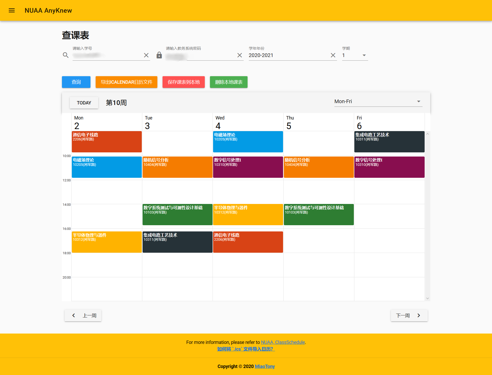

支持在线查课表、导出 icalendar 日历文件、保存课表到本地等功能。

**详情请访问 [NUAA AnyKnew](https://anyknew.a2os.club/Schedule?from=github)！**

[https://anyknew.a2os.club/Schedule](https://anyknew.a2os.club/Schedule?from=github)

欢迎来尝试哈~  

>**（不推荐使用旧版本了）**
>
>~~旧版 web 端版本部署在了 heroku 上，网址：[https://nuaaical.herokuapp.com/](https://nuaaical.herokuapp.com/)~~   
>旧版本的源码请参考`NUAA_iCal_Web`仓库。   
>https://github.com/miaotony/NUAA_iCal_Web

**Telegram Bot:**

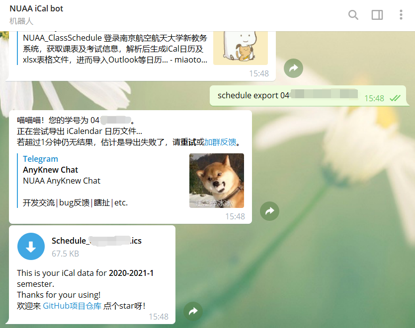

详情请使用 Telegram 搜索 [@NUAA_iCal_bot](https://t.me/NUAA_iCal_bot)。

---

以下为本地版本。

**使用打包好的 `.exe` 程序执行：** （详见 [Release](https://github.com/miaotony/NUAA_ClassSchedule/releases)）   

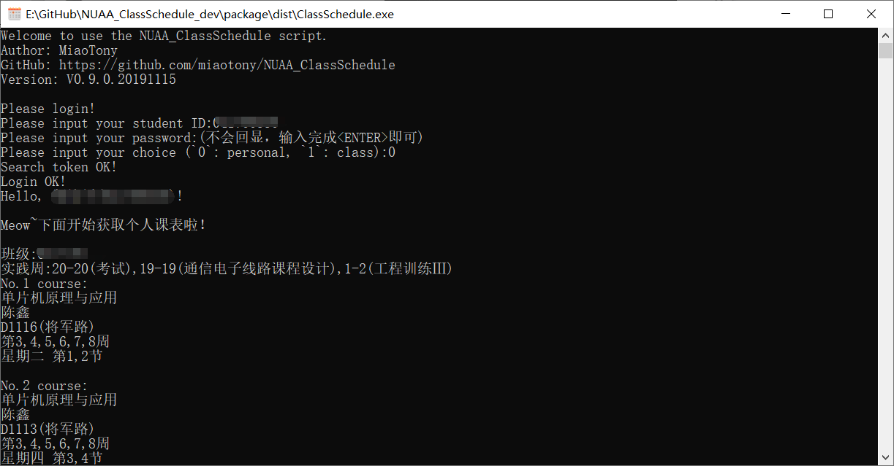  


**使用命令行参数：**  

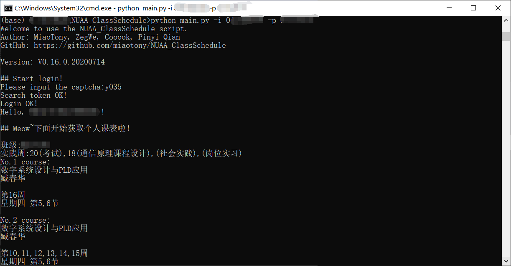  


**控制台输入：**  

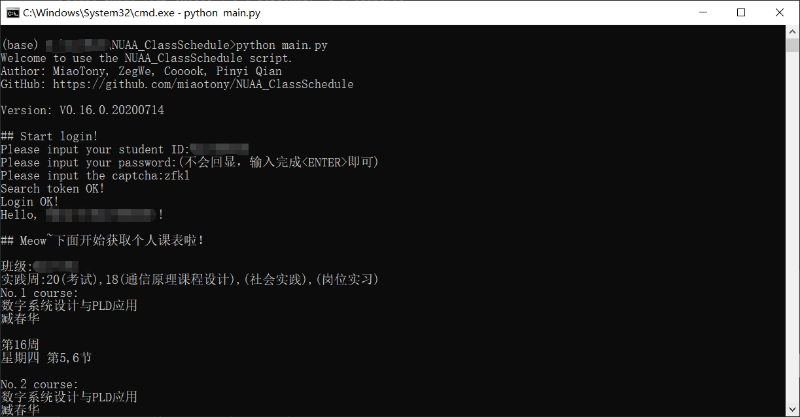  


**GUI界面：**（`V0.12.0.20191124`）    

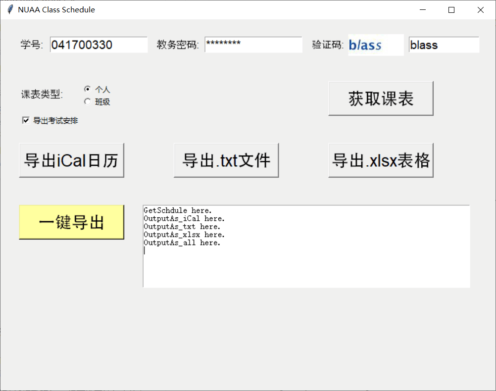


**导出 `.ics` 文件：**


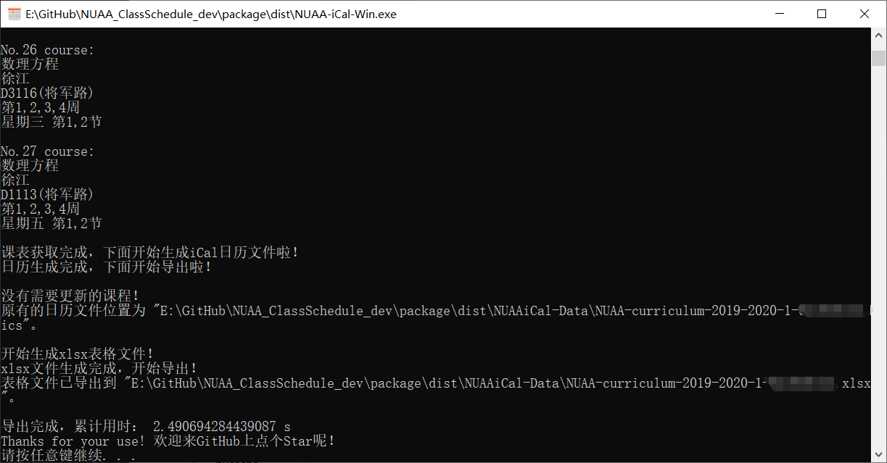  


**将`.ics`导入到Outlook的效果：**   

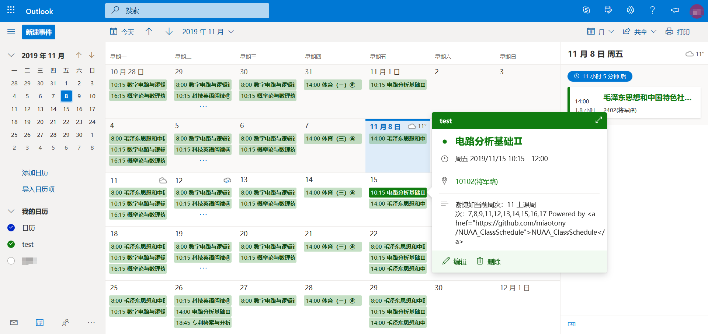  


**Outlook 客户端：**  

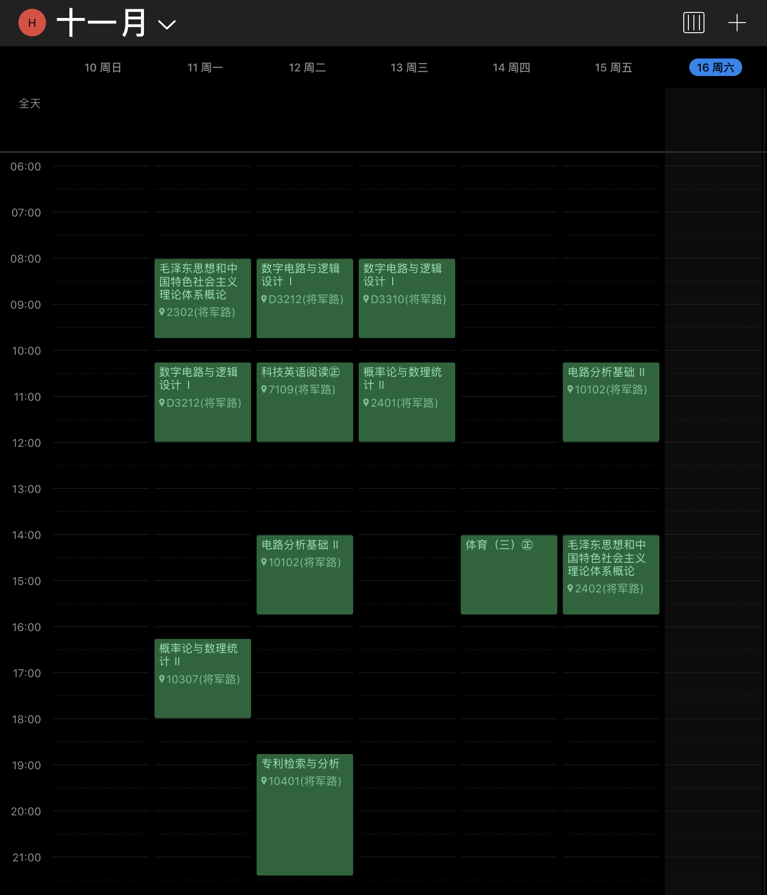  


**将课表导出到`.xlsx`文件：**  

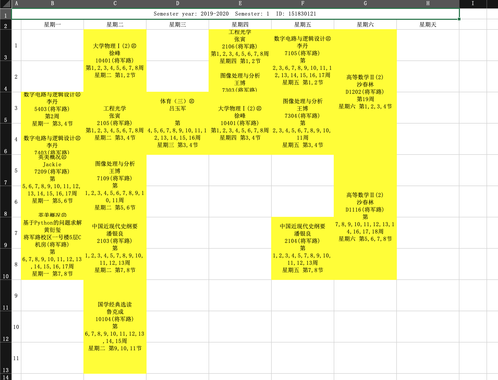


**导出到文本文件：**   

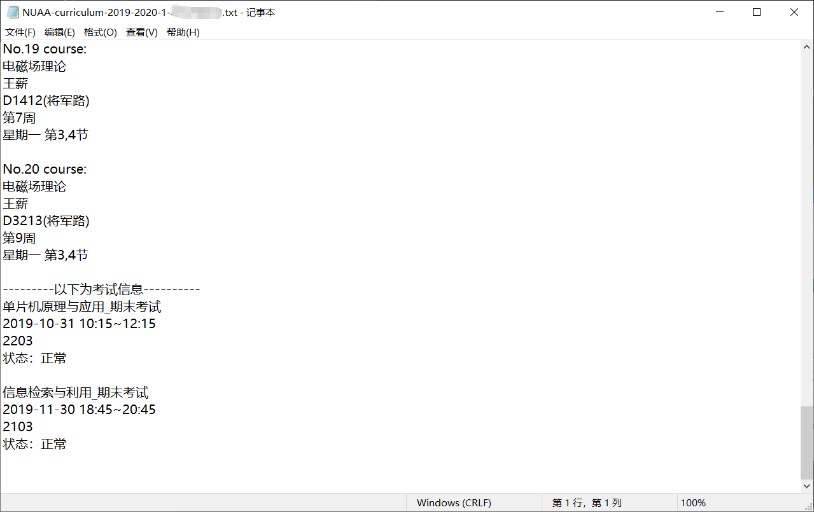


---

### Raw Data

课表解析部分原始 JavaScript 数据片段：   

> 20191107 更新：  
教务系统中`TaskActivity`函数新增了一个`teachClassName`参数，导致之前的版本匹配出现问题，
在 `V0.5.0.20191107` 版本中已经修复。  

```javascript
var teachers = [{id:2270,name:"任艳芳",lab:false}];
var actTeachers = [{id:2270,name:"任艳芳",lab:false}];
var assistant = _.filter(actTeachers, function(actTeacher) {
    return (_.where(teachers, {id:actTeacher.id,name:actTeacher.name,lab:actTeacher.lab}).length == 0) && (actTeacher.lab == true);
});
var assistantName = "";
if (assistant.length > 0) {
    assistantName = assistant[0].name;
    actTeachers = _.reject(actTeachers, function(actTeacher) {
        return _.where(assistant, {id:actTeacher.id}).length > 0;
    });
}
var actTeacherId = [];
var actTeacherName = [];
for (var i = 0; i < actTeachers.length; i++) {
    actTeacherId.push(actTeachers[i].id);
    actTeacherName.push(actTeachers[i].name);
}

    activity = new TaskActivity(
        actTeacherId.join(','),
            actTeacherName.join(','),
            "8340",
            "信息检索与利用",
            "548",
            "10302(将军路)",
            "00000011111110000000000000000000000000000000000000000",
            "",
            null,
            assistantName,
            "",
            "",
            "");
    index =0*unitCount+8;
    table0.activities[index][table0.activities[index].length]=activity;
    index =0*unitCount+9;
    table0.activities[index][table0.activities[index].length]=activity;
    
```

其中的`TaskActivity`函数如下：  
```javascript
// new taskAcitvity
function TaskActivity(teacherId,teacherName,courseId,courseName,roomId,roomName,vaildWeeks,taskId,remark,assistantName,experiItemName,schGroupNo, teachClassName){
    this.teacherId=teacherId;
    this.teacherName=teacherName;
    this.courseId=courseId;
    this.courseName=courseName;
    this.roomId = roomId;
    this.roomName = roomName;
    this.vaildWeeks = vaildWeeks;	// 53个01组成的字符串，代表了一年的53周
    this.taskId=taskId;
    this.marshal=marshalValidWeeks;
    this.addAbbreviate=addAbbreviate;
    this.clone=cloneTaskActivity;
    this.canMergeWith=canMergeWith;
    this.isSame=isSameActivity;
    this.toString=activityInfo;
    this.adjustClone=adjustClone;
    this.leftShift=leftShift;
    this.needLeftShift=needLeftShift;
    this.remark = remark;
    this.assistantName=assistantName;
    this.experiItemName=experiItemName;
    this.schGroupNo=schGroupNo;
    this.teachClassName = teachClassName;
}
```

  

---
## Known Issues

* **已知存在的 bug 详见 [issues#17](https://github.com/miaotony/NUAA_ClassSchedule/issues/17)。** Please refer to [issues#17 Known Issues](https://github.com/miaotony/NUAA_ClassSchedule/issues/17).   

* 考虑到不同课表在解析上可能存在差异，且随着时间发展页面的访问可能会发生变化，目前版本具有时效性。  

* 对于存在的问题和疑问，欢迎在 issue 中提出，也欢迎提出 PR 哈！  


---
## TODO

**Please refer to [issues: TODO list](https://github.com/miaotony/NUAA_ClassSchedule/issues/16).**    

---
## Reference

开源项目 `NUAA-Open-Source/NUAA-iCal-Python`  
>项目网址：[https://github.com/NUAA-Open-Source/NUAA-iCal-Python](https://github.com/NUAA-Open-Source/NUAA-iCal-Python)     
    
这是个（已经毕业了的）学长开发的小项目，但老接口随着新教务系统的启用而关闭，进而原脚本无法继续使用。

在开发本项目过程中，解析课表之后，受到了此项目的启发，参考其实现了 iCal 日历文件的生成。在此非常感谢原作者！  


---
## Sponsorship

如果真想赞助的话  

`WeChat`:   


爱发电 afdian:  

[https://afdian.net/@miaotony](https://afdian.net/@miaotony)  


非常感谢啦！  

如果能给校园生活多一些便利，感觉也挺满足的啦。  

**更希望有小伙伴来继续开发和维护这个项目啦~**  

---
## Copyright

网络非法外之地，本项目相关技术内容仅供学习研究，请在合理合法范围内使用！  
The relevant technical content of this project is only for study and research, please use within the reasonable and legal scope!

**License:**    
**[GNU General Public License v3.0](LICENSE)**  

未经允许不得商用！  
Non-commercial use!    

最终解释权归本项目开发者所有。  
The final interpretation right belongs to the developers of the project.  


Copyright © 2019-2023 [MiaoTony](https://github.com/miaotony)  & other developers.  

